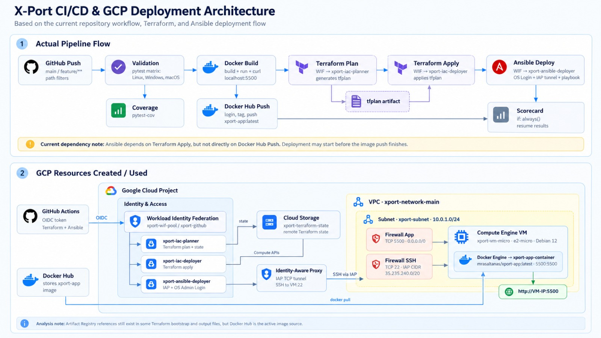

# X-Port Program



X-Port is a small Flask application used to practice an end-to-end deployment workflow with **Python, Docker, Terraform, Ansible, Google Cloud and GitHub Actions**.

The application runs on port **5500** and is deployed as a Docker container on a Google Compute Engine VM.

## Architecture

The deployment flow is:

```text
GitHub Actions
    │
    ├── Tests and coverage
    ├── Docker build and push → Docker Hub
    ├── Terraform plan/apply → Google Cloud
    └── Ansible → IAP + OS Login → Compute Engine VM
                                      │
                                      └── Docker → X-Port App :5500
```

Terraform manages:

- Custom VPC and subnet.
- Debian 12 `e2-micro` Compute Engine VM.
- TCP `5500` for the application.
- TCP `22` restricted to the Google IAP range `35.235.240.0/20`.
- OS Login for SSH access.
- Remote Terraform state in Google Cloud Storage.

GitHub Actions authenticates to GCP through **Workload Identity Federation**, and Ansible reaches the VM through **IAP** instead of exposing SSH to the Internet.

## Run locally

Requirements: Python 3.14+, Git and Docker.

```bash
git clone https://github.com/Bryan-tec/x-port-program.git
cd x-port-program

python -m venv venv
source venv/bin/activate
pip install -r requirements.txt
python app.py
```

Open:

```text
http://localhost:5500
```

Or run with Docker:

```bash
docker build -t xport-app .
docker run -p 5500:5500 xport-app
```

## Tests

```bash
python -m pytest -v tests/
python -m pytest --cov=app tests/
```

## Terraform configuration

Create your local Terraform variables file from the included example:

```bash
cp terraform/terraform.tfvars.example terraform/terraform.tfvars
```

Example:

```hcl
project_id      = "your-gcp-project-id"
region          = "us-central1"
zone            = "us-central1-a"
machine_type    = "e2-micro"
repository_name = "xport-images"
```

`terraform.tfvars` is ignored by Git and should not contain committed environment-specific values.

The main Terraform configuration uses a GCS backend. Before the first `terraform init`, make sure the bucket configured in `terraform/backend.tf` exists and is accessible.

## One-time GCP bootstrap

The `terraform/bootstrap/` configuration creates the APIs, service accounts, IAM permissions and Workload Identity Federation resources required by GitHub Actions.

Authenticate locally:

```bash
gcloud auth application-default login
```

Then run:

```bash
cd terraform/bootstrap
terraform init
terraform apply -var="project_id=YOUR_GCP_PROJECT_ID"
```

If this repository is forked or copied to another GitHub account, update the repository and owner IDs used in the bootstrap WIF/IAM configuration before applying it.

Use the bootstrap outputs to configure these GitHub Actions variables:

```text
GCP_PROJECT_ID
GCP_ZONE
GCP_WORKLOAD_IDENTITY_PROVIDER
GCP_TERRAFORM_PLAN_SA
GCP_TERRAFORM_APPLY_SA
GCP_ANSIBLE_DEPLOY_SA
```

Docker Hub authentication is provided through:

```text
DOCKER_USERNAME
DOCKER_PASSWORD
```

## Deployment

The GitHub Actions workflow performs the deployment automatically:

```text
Validation
   ↓
Coverage
   ↓
Docker build / registry
   ↓
Terraform plan
   ↓
Terraform apply
   ↓
Ansible over IAP
   ↓
Application health check
```

Ansible installs and starts Docker, pulls the application image, runs the container on port `5500`, and validates the application from inside the VM.

After a successful deployment, obtain the VM public IP with:

```bash
cd terraform
terraform output -raw vm_public_ip
```

Then open:

```text
http://<VM_PUBLIC_IP>:5500
```

## Main directories

```text
.github/workflows/   GitHub Actions CI/CD
ansible/             VM configuration and application deployment
terraform/           GCP infrastructure
terraform/bootstrap/ WIF, IAM and service-account bootstrap
image/               Project architecture image
templates/           Flask templates
tests/               Application tests
```
