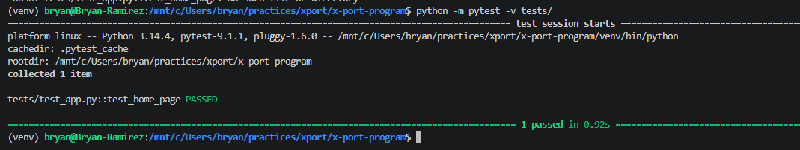
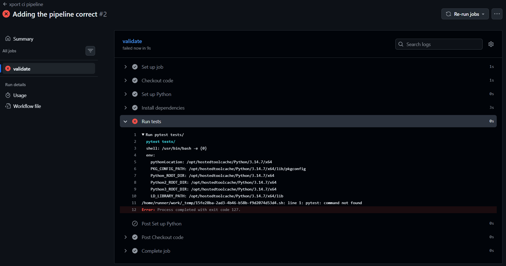
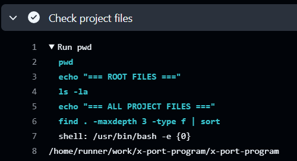

# x-port-program
This is the repo for the final application for the Xport program

---------------------------------
Install Python and the Virtual Environment

```
 - sudo apt update 
 - python3 -m venv venv
    The venv installed did not have the 'activate' script

 - apt install python3.14-venv
    - source venv/bin/activate

 - pip install Flask
    - pip freeze > requirements.txt

 - pip install pytest
    - grep pytest requirements.txt

Validation commands:
    which python
    python --version
    pip --version
```

--------------------------------
## External Resources Used

 - [How to Build a Web application Digital Ocean](https://www.digitalocean.com/community/tutorials/how-to-make-a-web-application-using-flask-in-python-3) 
 - [HTML](https://www.freecodecamp.org/espanol/news/como-alinear-texto-en-html-ejemplo-de-text-align-center-y-justified/)
 - [FLASK](https://flask.palletsprojects.com/en/stable/)
 - [GH Actions](https://github.com/marketplace?type=actions)
 - []()
 - []()
 - []()


-------------------------------
## General Errors:


### Havin issues with the pytest test in the files, since the pytest package was not running succesfully locally but not in the pipeline



### I received an error where the pipeline in GitHub Actions shows that the runner was not receiving the app.py file, it was impossible to run the pytest, and when the pytest run, it fails because there was no test defined in test_app.py ```ImportError while importing test module '/home/runner/work/x-port-program/x-port-program/tests/test_app.py'.``` 

 - I added some test toi investigate in order to gather more information and I created a new sted with the commands like: pwd, ls -la, find . -maxdepth -type f
 - Haveing that information I was expecting validate the real files that the GitHub was reading to create the tests, but suddenly, the test passed
 

